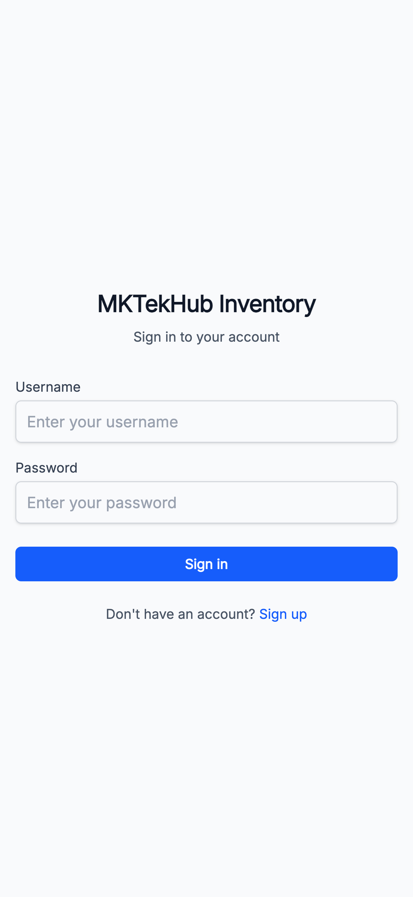
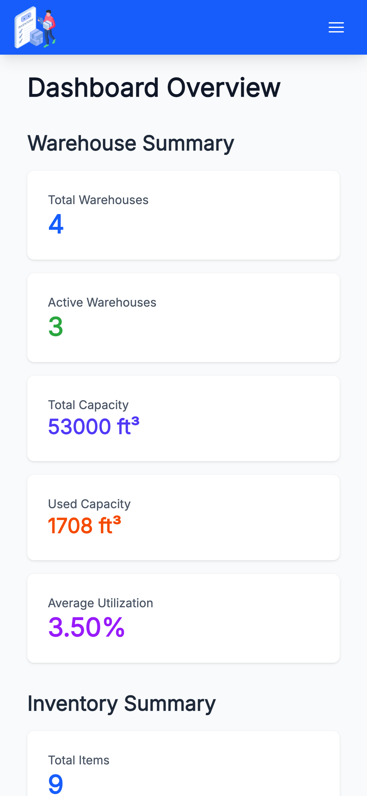
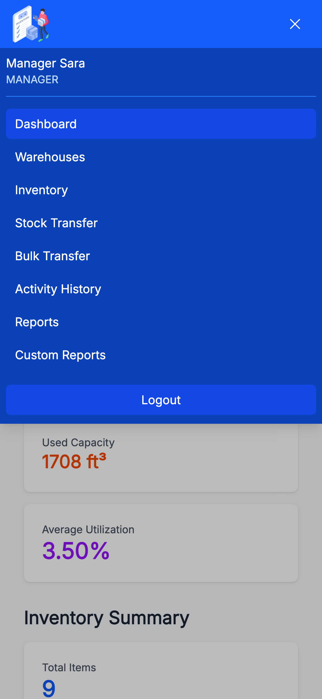
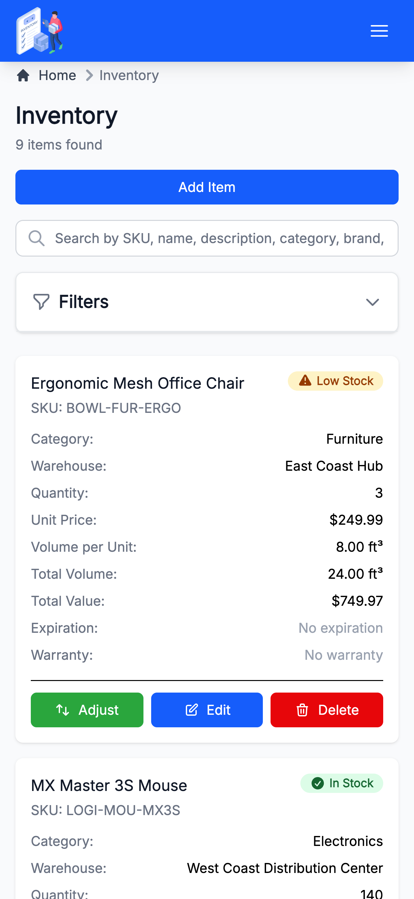
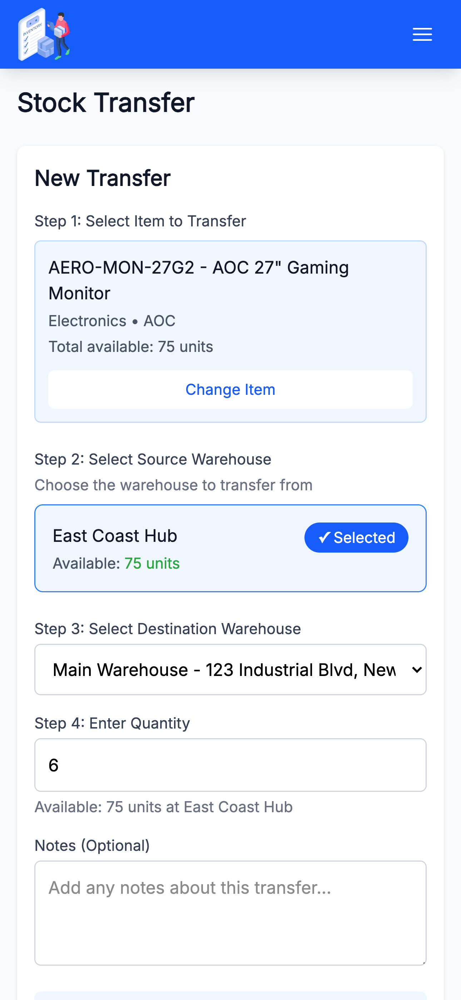
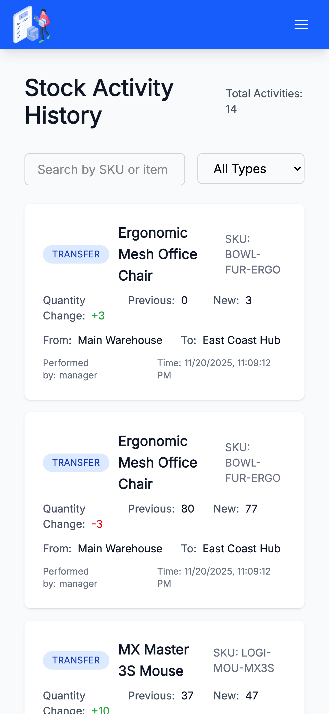
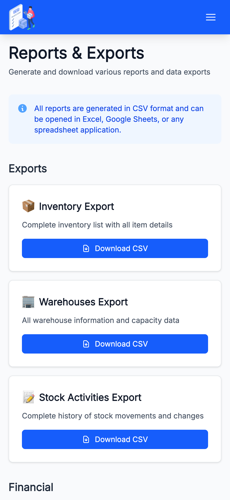
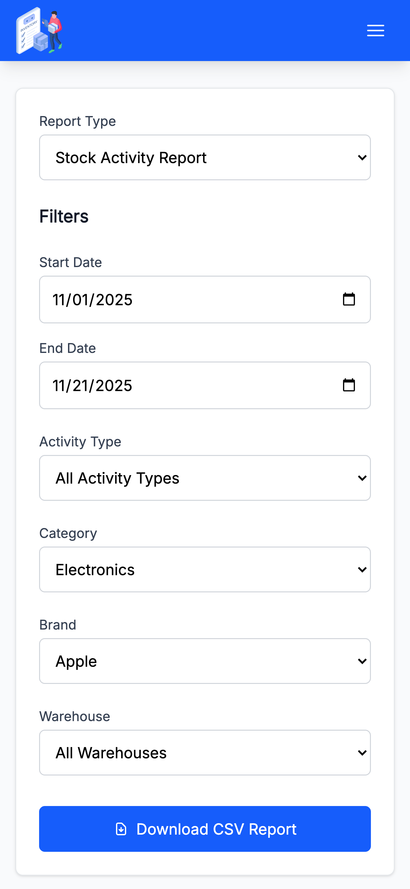

# mktekhub - Warehouse Inventory Management System

A full-stack warehouse inventory management system with multi-warehouse support, stock tracking, real-time alerts, and comprehensive reporting capabilities.

## Overview

mktekhub is a modern enterprise-grade inventory management platform designed to handle complex warehouse operations including:

- Multi-warehouse inventory tracking
- Volume-based warehouse capacity management
- Stock transfers and bulk operations
- Real-time alerts for low stock, expiration dates, and capacity limits
- Comprehensive analytics and reporting
- Role-based access control (RBAC)
- Audit trail for all inventory movements

## Screenshots

<p>
  
  
 
</p> 
<p>
  
  
  
</p>
<p>
  
  
  
</>

## Architecture

### Frontend

- **Framework:** React 19 with TypeScript
- **Build Tool:** Vite
- **Styling:** Tailwind CSS v4
- **State Management:** TanStack Query + React Context
- **Routing:** React Router v7

### Backend

- **Framework:** Spring Boot 3.5.7
- **Language:** Java 17
- **Database:** PostgreSQL 15+
- **Authentication:** JWT (JSON Web Tokens)
- **Security:** Spring Security with BCrypt
- **API Documentation:** SpringDoc OpenAPI (Swagger)

### Database

- **Primary:** PostgreSQL with custom ENUM types
- **Testing:** H2 in-memory database
- **ORM:** Hibernate/JPA with Spring Data

## Project Structure

```
mktekhub/
├── mktekhub-frontend/          # React TypeScript frontend
│   ├── src/
│   │   ├── components/         # Reusable UI components
│   │   ├── pages/              # Page components
│   │   ├── services/           # API service layer
│   │   ├── contexts/           # React contexts
│   │   ├── types/              # TypeScript definitions
│   │   └── utils/              # Utility functions
│   ├── package.json
│   └── README.md
│
├── mktekhub-backend/           # Spring Boot REST API
│   ├── src/
│   │   ├── main/
│   │   │   ├── java/com/mktekhub/inventory/
│   │   │   │   ├── controller/     # REST endpoints
│   │   │   │   ├── service/        # Business logic
│   │   │   │   ├── repository/     # Data access
│   │   │   │   ├── model/          # JPA entities
│   │   │   │   ├── security/       # JWT & auth
│   │   │   │   ├── dto/            # Data transfer objects
│   │   │   │   └── exception/      # Error handling
│   │   │   └── resources/
│   │   │       ├── application.yml # Configuration
│   │   │       └── schema.sql      # Database schema
│   │   └── test/                   # Unit & integration tests
│   ├── pom.xml
│   └── README.md
│
├── Docs/                       # Project documentation
│   ├── ERD-MKTEKHUB.jpg        # Entity Relationship Diagram
│   ├── ERD-Schema-Updated.md   # Database schema documentation
│   └── Requirements.md         # Project requirements
│
└── README.md                   # This file
```

## Key Features

### Inventory Management

- Complete CRUD operations for inventory items
- SKU-based product tracking
- Category and brand organization
- Unit price and quantity management
- Volume tracking per item (cubic feet)
- Barcode support
- Warranty and expiration date tracking

### Warehouse Management

- Multiple warehouse locations
- Volume-based capacity tracking (cubic feet)
- Capacity utilization monitoring
- Configurable alert thresholds (default 80%)
- Active/inactive warehouse status
- Soft and hard delete options

### Stock Operations

- Single item transfers between warehouses
- Bulk transfer operations
- Quantity adjustments with audit trail
- Stock receiving and dispatch
- Sale tracking
- Automatic capacity validation

### Alerts & Monitoring

- Low stock alerts based on reorder levels
- Expiration date warnings (customizable days)
- Expired items tracking
- Warranty expiration monitoring
- Warehouse capacity alerts
- Real-time toast notifications in UI

### Reporting & Analytics

- Dashboard with comprehensive statistics
- Stock valuation reports
- Warehouse utilization reports
- Stock movement analysis
- Inventory by category breakdown
- CSV export for all major entities
- Custom filtered reports

### Security & Access Control

- JWT-based stateless authentication
- Role-based access control (ADMIN, MANAGER, VIEWER)
- BCrypt password encryption
- Secure API endpoints
- CORS configuration
- Method-level security

### Audit & Compliance

- Complete activity log for all stock movements
- User action tracking
- Timestamp tracking for all entities
- Soft delete for data retention
- Audit trail with previous/new quantity tracking

## Quick Start

### Prerequisites

**Frontend:**

- Node.js v18 or higher
- npm or yarn

**Backend:**

- Java 17 or higher (JDK)
- PostgreSQL 15+
- Maven 3.x (or use included wrapper)

### Installation

1. **Clone the repository:**

```bash
git clone <repository-url>
cd mktekhub
```

2. **Set up the database:**

```bash
# Create PostgreSQL database
createdb mktekhub

# Run schema initialization
psql -U your_username -d mktekhub -f mktekhub-backend/src/main/resources/schema.sql
```

3. **Configure the backend:**

Edit `mktekhub-backend/src/main/resources/application.yml`:

```yaml
spring:
  datasource:
    url: jdbc:postgresql://localhost:5432/mktekhub
    username: your_username
    password: your_password
```

4. **Start the backend:**

```bash
cd mktekhub-backend
./mvnw spring-boot:run
```

Backend will start at `http://localhost:8080`

5. **Start the frontend:**

```bash
cd mktekhub-frontend
npm install
npm run dev
```

Frontend will start at `http://localhost:3000`

6. **Access the application:**

- **Web UI:** http://localhost:3000
- **API Docs:** http://localhost:8080/swagger-ui.html
- **API Endpoint:** http://localhost:8080/api

## Default Setup

On first run, the backend automatically initializes:

### Default Roles

- ADMIN - Full system access
- MANAGER - Operational management
- VIEWER - Read-only access (default for new users)

### Sample Warehouses

- Main Warehouse (10,000 cu ft, New York)
- West Coast Distribution Center (15,000 cu ft, Los Angeles)
- East Coast Hub (8,000 cu ft, Boston)

### Getting Started

1. Navigate to http://localhost:3000
2. Click "Sign Up" to create an account
3. Login with your credentials
4. Start managing inventory!

## API Documentation

### Interactive API Docs

Once the backend is running, access comprehensive API documentation:

**Swagger UI:** http://localhost:8080/swagger-ui.html

Features:

- Complete endpoint documentation
- Request/response schemas
- Interactive API testing
- JWT authentication support

### Main API Endpoints

**Authentication (Public):**

- `POST /api/auth/signup` - Register new user
- `POST /api/auth/login` - Login and receive JWT token

**Inventory:**

- `GET /api/inventory` - List all items
- `POST /api/inventory` - Create item (ADMIN/MANAGER)
- `PUT /api/inventory/{id}` - Update item (ADMIN/MANAGER)
- `DELETE /api/inventory/{id}` - Delete item (ADMIN/MANAGER)

**Warehouses:**

- `GET /api/warehouses` - List all warehouses
- `POST /api/warehouses` - Create warehouse (ADMIN/MANAGER)
- `PUT /api/warehouses/{id}` - Update warehouse (ADMIN/MANAGER)

**Stock Transfer:**

- `POST /api/stock-transfer` - Transfer stock
- `POST /api/stock-transfer/bulk` - Bulk transfer

**Reports:**

- `GET /api/reports/export/inventory` - Export to CSV
- `GET /api/reports/valuation` - Stock valuation
- `GET /api/reports/warehouse-utilization` - Utilization report

See individual README files for complete endpoint documentation:

- [Backend API Documentation](mktekhub-backend/README.md#api-endpoints)
- [Frontend Architecture](mktekhub-frontend/README.md)

## Technology Stack

### Frontend Technologies

| Technology      | Version | Purpose                 |
| --------------- | ------- | ----------------------- |
| React           | 19      | UI framework            |
| TypeScript      | Latest  | Type safety             |
| Vite            | Latest  | Build tool & dev server |
| React Router    | v7      | Client-side routing     |
| TanStack Query  | Latest  | Server state management |
| Tailwind CSS    | v4      | Utility-first styling   |
| Axios           | Latest  | HTTP client             |
| Vitest          | Latest  | Unit testing            |
| Testing Library | Latest  | Component testing       |

### Backend Technologies

| Technology        | Version | Purpose                        |
| ----------------- | ------- | ------------------------------ |
| Spring Boot       | 3.5.7   | Application framework          |
| Java              | 17      | Programming language           |
| PostgreSQL        | 15+     | Primary database               |
| Spring Security   | 6.x     | Authentication & authorization |
| JJWT              | 0.12.6  | JWT implementation             |
| SpringDoc OpenAPI | 2.8.14  | API documentation              |
| JUnit 5           | Latest  | Testing framework              |
| Mockito           | Latest  | Mocking framework              |
| JaCoCo            | 0.8.12  | Code coverage                  |
| Spotless          | 2.43.0  | Code formatting                |

## Development

### Frontend Development

```bash
cd mktekhub-frontend

# Install dependencies
npm install

# Start dev server
npm run dev

# Run tests
npm test

# Run linter
npm run lint

# Format code
npm run format:write

# Build for production
npm run build
```

### Backend Development

```bash
cd mktekhub-backend

# Build project
./mvnw clean install

# Run application
./mvnw spring-boot:run

# Run tests
./mvnw test

# Generate coverage report
./mvnw clean test jacoco:report

# Format code
./mvnw spotless:apply

# Build for production
./mvnw clean package -DskipTests
```

## Testing

### Frontend Testing

- **Framework:** Vitest with React Testing Library
- **Coverage:** Comprehensive tests for components, services, contexts, and utilities
- **Commands:**
  - `npm test` - Run tests in watch mode
  - `npm run test:ui` - Interactive test UI
  - `npm run test:coverage` - Generate coverage report

### Backend Testing

- **Framework:** JUnit 5 with Mockito
- **Coverage:** 50% minimum line coverage (enforced by JaCoCo)
- **Test Database:** H2 in-memory for fast execution
- **Test Types:**
  - Unit tests for services and utilities
  - Integration tests for controllers
  - Security tests for JWT and authentication
  - Repository tests for custom queries

## Code Quality

### Frontend

- **ESLint** - JavaScript/TypeScript linting
- **Prettier** - Code formatting
- **TypeScript** - Strict type checking

### Backend

- **Spotless** - Automatic code formatting (Google Java Format)
- **JaCoCo** - Code coverage enforcement
- **SonarLint** - Code quality analysis

## Database Schema

### Key Entities

**Users & Authentication:**

- users
- roles
- user_roles (many-to-many)

**Inventory Management:**

- inventory_items
- warehouses
- stock_activities
- audits

### Entity Relationship Diagram

See [Docs/FINAL_ERD.png](Docs/FINAL_ERD.png) for the complete database schema visualization.

Detailed schema documentation: [Docs/ERD-Schema-Updated.md](Docs/ERD-Schema-Updated.md)

## User Roles & Permissions

### VIEWER (Default)

- View inventory and warehouses
- View reports and analytics
- Export data to CSV
- No modification rights

### MANAGER

- All VIEWER permissions
- Create, update, delete inventory items
- Create, update, delete warehouses (soft delete)
- Perform stock transfers
- Adjust inventory quantities
- View all alerts

### ADMIN

- All MANAGER permissions
- Permanently delete warehouses (hard delete)
- User management
- Full system access

## Production Deployment

### Frontend Production Build

```bash
cd mktekhub-frontend
npm run build
```

Output will be in `dist/` directory. Serve with any static file server or deploy to:

- Vercel
- Netlify
- AWS S3 + CloudFront
- nginx

### Backend Production Build

```bash
cd mktekhub-backend
./mvnw clean package -DskipTests
```

Run the JAR:

```bash
java -jar target/mktekhub-backend-0.0.1-SNAPSHOT.jar
```

Or with production profile:

```bash
java -jar -Dspring.profiles.active=prod target/mktekhub-backend-0.0.1-SNAPSHOT.jar
```

### Environment Configuration

Use environment variables for sensitive data:

```bash
export SPRING_DATASOURCE_URL=jdbc:postgresql://prod-db:5432/mktekhub
export SPRING_DATASOURCE_USERNAME=prod_user
export SPRING_DATASOURCE_PASSWORD=prod_password
export JWT_SECRET=your-production-secret-key
```

## Documentation

- **[Frontend README](mktekhub-frontend/README.md)** - Frontend architecture, components, and development guide
- **[Backend README](mktekhub-backend/README.md)** - Backend API, endpoints, and configuration
- **[Requirements](Docs/Requirements.md)** - Project requirements and specifications
- **[Database Schema](Docs/ERD-Schema-Updated.md)** - Detailed database documentation
- **[ERD Diagram](Docs/ERD-MKTEKHUB.jpg)** - Visual database schema

## Contributing

1. **Code Style:**

   - Frontend: Follow ESLint and Prettier configurations
   - Backend: Run Spotless formatting (`./mvnw spotless:apply`)

2. **Testing:**

   - Write tests for new features
   - Maintain >50% code coverage for backend
   - Ensure all tests pass before committing

3. **Git Workflow:**

   - Create feature branches from `main`
   - Write clear commit messages
   - Submit pull requests for review

4. **Documentation:**
   - Update README files for significant changes
   - Document new API endpoints
   - Add code comments for complex logic

## Troubleshooting

### Common Issues

**Frontend won't start:**

```
Error: Cannot find module...
Solution: Delete node_modules and package-lock.json, then run npm install
```

**Backend database connection failed:**

```
Error: Connection refused
Solution: Ensure PostgreSQL is running and credentials in application.yml are correct
```

**CORS errors in browser:**

```
Error: CORS policy blocked
Solution: Verify backend CORS configuration includes your frontend URL
```

**JWT token expired:**

```
Error: 401 Unauthorized
Solution: Login again to get a fresh token (24-hour expiration)
```

**Port already in use:**

```
Frontend: Change port in vite.config.ts
Backend: Change server.port in application.yml
```

### Getting Help

- Check the [Frontend README](mktekhub-frontend/README.md) for frontend-specific issues
- Check the [Backend README](mktekhub-backend/README.md) for backend-specific issues
- Review application logs for detailed error messages
- Verify database schema matches schema.sql
- Check JWT token in browser developer tools

## Performance Considerations

### Frontend

- Code splitting with lazy loading
- React Query for efficient data caching
- Optimized production builds with Vite
- Responsive design for mobile and desktop

### Backend

- Database query optimization with JPA
- Connection pooling for database efficiency
- Stateless JWT for horizontal scaling
- Indexed database columns for fast lookups
- Transactional consistency for data integrity

## Security Best Practices

- Passwords encrypted with BCrypt
- JWT tokens with 24-hour expiration
- HTTPS recommended for production
- SQL injection prevention via JPA parameterized queries
- XSS protection via React's built-in escaping
- CSRF protection (disabled for stateless API)
- Role-based authorization on sensitive endpoints
- Environment variables for secrets

## Future Enhancements

Potential features for future development:

- [ ] Email notifications for low stock alerts
- [ ] Barcode scanning integration
- [ ] Mobile app (React Native)
- [ ] Advanced analytics and forecasting
- [ ] Multi-tenant support
- [ ] Internationalization (i18n)
- [ ] Real-time updates with WebSockets
- [ ] Batch import from CSV/Excel
- [ ] Custom report builder
- [ ] Integration with shipping providers

## License

This project is part of the SKILLSTORM training program.

## Acknowledgments

Developed as part of the SKILLSTORM Java training program with EY.

---

**Project Status:** Active Development

**Last Updated:** January 2025

For detailed information about specific components, please refer to:

- [Frontend Documentation](mktekhub-frontend/README.md)
- [Backend Documentation](mktekhub-backend/README.md)
